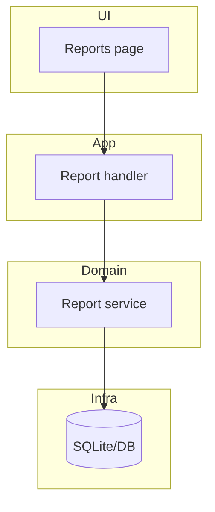

# Example — export feature — component as-is

```mermaid
flowchart TB
  subgraph UI
    Page[Reports page]
  end
  subgraph App
    Handler[Report handler]
  end
  subgraph Domain
    ReportSvc[Report service]
  end
  subgraph Infra
    DB[(SQLite/DB)]
  end
  Page --> Handler --> ReportSvc --> DB
```

Caption: Users view reports in-app only; no export path today.
