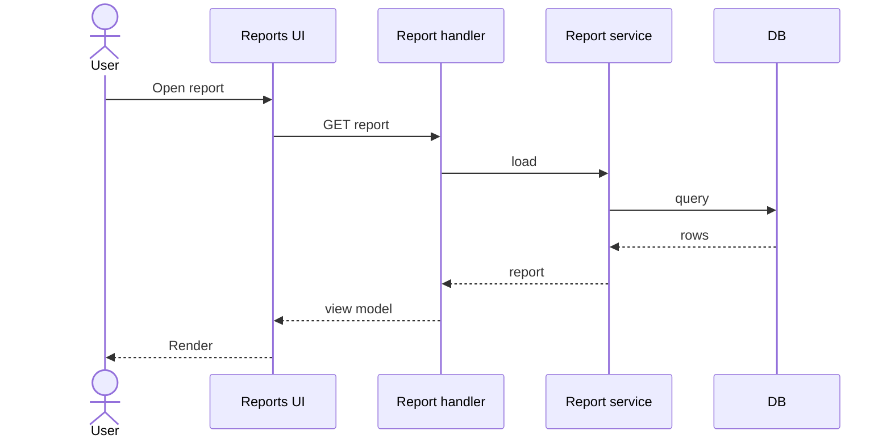

# Example — export feature — sequence as-is

```mermaid
sequenceDiagram
  actor U as User
  participant UI as Reports UI
  participant API as Report handler
  participant S as Report service
  participant DB as DB
  U->>UI: Open report
  UI->>API: GET report
  API->>S: load
  S->>DB: query
  DB-->>S: rows
  S-->>API: report
  API-->>UI: view model
  UI-->>U: Render
```
